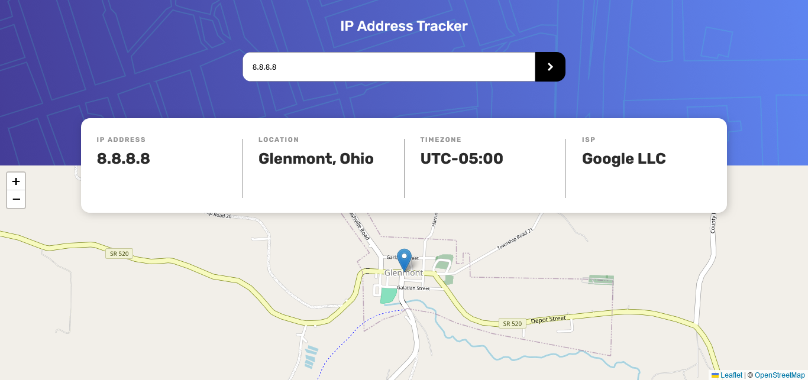

# Frontend Mentor - IP address tracker

## Tabla de Contenido

- [Introducción](#introduccion)
  - [El Desafío](#el-desafío)
  - [Captura de Pantalla](#captura-de-pantalla)
  - [Links](#links)
- [Mi Proceso](#mi-proceso)
  - [Tecnologías](#tecnologías)
- [Autor](#autor)

## Introduccion

### El Desafío

Crear una página con la que poder buscar una dirección IP o un Dominio y recoger su localización, zona horaria y su ISP. Para obtener los datos se utiliza la API: [IP Geolocation API by IPify](https://geo.ipify.org/). Se generará también un mapa con su punto de localización para lo que se utilizará la API: [LeafletJS](https://leafletjs.com/).

Los usuarios deberian poder:

- Ver la página correctamente en cualquier tamaño de dispositivo.
- Ver los estados de hover de todos los elementos interactivos de la página.
- Ver inicialmente la localización en el mapa de la propia IP.
- Buscar una dirección IP o Dominio y ver sus datos y localización en el mapa.

### Captura de Pantalla

### Links

- Solución URL: [Solución]()
- Live Site URL: [Site]()

## Mi Proceso

### Tecnologías

- Flexbox
- Grid
- BEM
- SASS/SCSS
- API

## Autor

- Frontend Mentor - [@jcarloscab](https://www.frontendmentor.io/profile/jcarloscab)
- GitHub - [@jcarloscab](https://github.com/jcarloscab)
